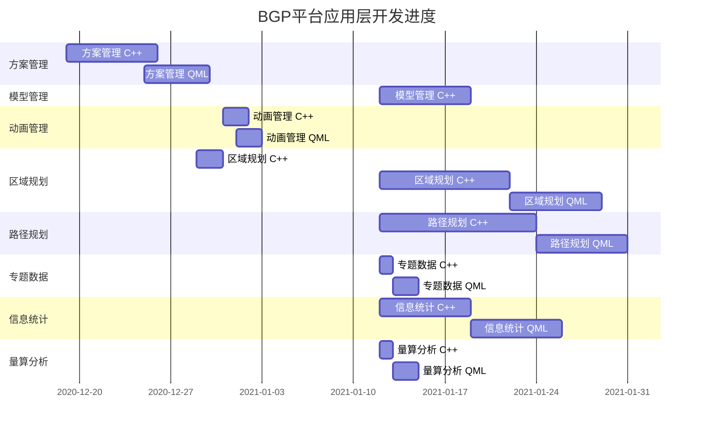

BGP平台应用层开发计划
| 模块名称 | 计划开发时长（天） | 实际开发时长（天） | 进度（%） | 备注           |
| -------- | ------------------ | ------------------ | --------- | -------------- |
| 方案管理 | 14                 | 12                 | 60        |                |
| 模型管理 | 07                 |                    |           |                |
| 动画管理 | 14                 | 2                  | 5         | 杨天宇提供接口 |
| 区域规划 | 10                 | 2                  | 10        |                |
| 路径规划 | 12                 |                    |           |                |
| 专题数据 | 03 (C++ 1, QML 2)  |                    |           | 杨天宇提供接口 |
| 信息统计 | 07                 |                    |           |                |
| 量算分析 | 03 (C++ 1, QML 2)  |                    |           | 杨天宇提供接口 |

