# BGP平台应用层设计

| 编写   | 版本     | 日期       |
| ------ | -------- | ---------- |
| 魏晓亮 | v0.0.0.1 | 2020/08/31 |
| 魏晓亮 | v0.0.0.2 | 2020/12/16 |
| 魏晓亮 | v0.0.0.4 | 2020/12/25 |
| 魏晓亮 | v0.0.0.6 | 2021/01/07 |

## 目录

[TOC]


## 概述

系统应用层包含方案管理、模型管理、动画管理、区域规划、路径规划、专题数据、信息统计、量算分析等模块。

用户界面包含欢迎页（方案、教程、示例）、编辑页（动画、区域、路径）、演示页（演示模拟过程、动画）、信息页（统计图表）、设置页（专题数据、日期设置、界面选项）等主要页面。

## 界面

### **主界面**

导航栏由欢迎、编辑、演示、信息、设置五项组成，分别对应同名的五大页面（如下图）。

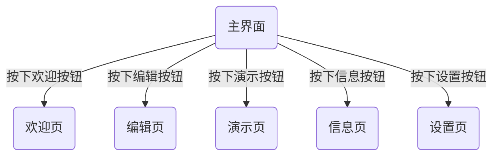
```mermaid
graph TD; 
MainWindow(主界面)-->|按下欢迎按钮|WelcomPage(欢迎页); 
MainWindow(主界面)-->|按下编辑按钮|EditPage(编辑页); 
MainWindow(主界面)-->|按下演示按钮|PlayPage(演示页); 
MainWindow(主界面)-->|按下信息按钮|InfoPage(信息页); 
MainWindow(主界面)-->|按下设置按钮|SettingPage(设置页); 
```

### 欢迎页

用户启动时，默认打开欢迎页面。欢迎页包含方案、教程、示例三个标签页。

在方案标签页进行新建或加载操作将跳转到编辑页面。编辑页面中有修改时，可以通过快捷键或按下方案页的保存按钮进行保存。

*提问：是否需要快捷工具栏以方便用户点击按钮保存？*

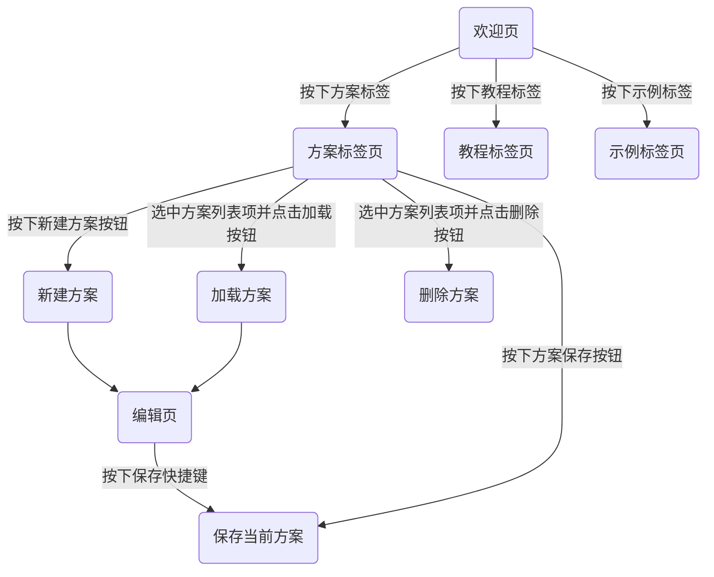
```mermaid
graph TD; 
WelcomPage(欢迎页)-->|按下方案标签|ScenarioPage(方案标签页); 
ScenarioPage-->|按下新建方案按钮|Add(新建方案); 
Add-->EditPage(编辑页); 
ScenarioPage-->|选中方案列表项并点击加载按钮|Load(加载方案); 
Load-->EditPage(编辑页); 
EditPage-->|按下保存快捷键|Save; 
ScenarioPage-->|按下方案保存按钮|Save(保存当前方案); 
ScenarioPage-->|选中方案列表项并点击删除按钮|Remove(删除方案); 
WelcomPage(欢迎页)-->|按下教程标签|TutorialPage(教程标签页); 
WelcomPage(欢迎页)-->|按下示例标签|ExamplePage(示例标签页); 
```

**方案标签页**：包含新建方案（按钮/对话框）、我的收藏列表（预览/更多）、我的方案列表（预览/更多）。

原型图如下：

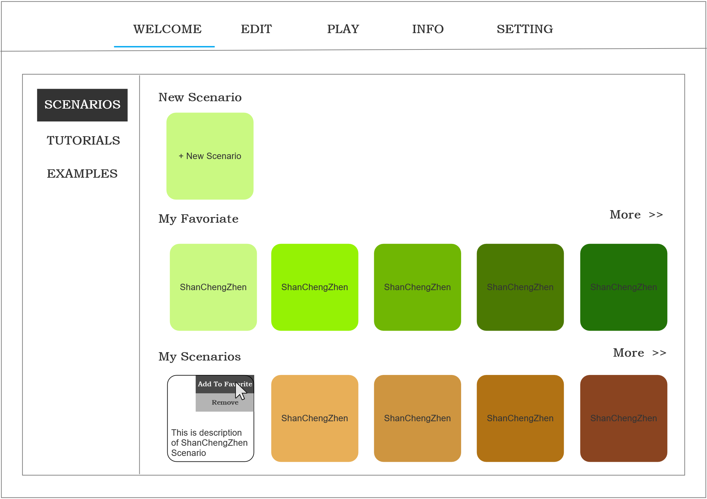

~~当鼠标在方案列表项悬停时，将方案缩略图切换为显示方案文字描述，同时显示删除按钮、添加/移除收藏按钮。~~

**新建方案**

新建方案只需要输入方案名称即可。

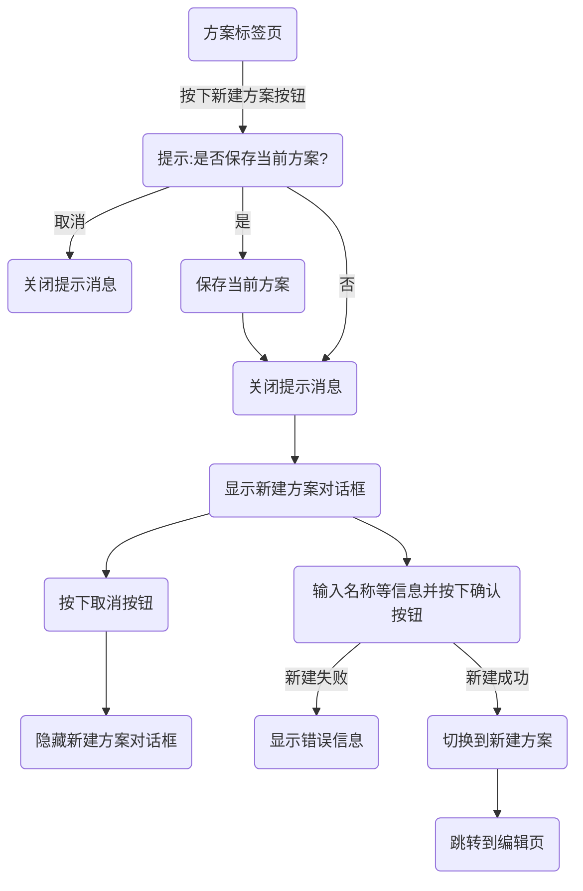
```mermaid
graph TD; 
ScenariosPage(方案标签页)-->|按下新建方案按钮|AskForSaveCurrentScenario(提示:是否保存当前方案?); 
AskForSaveCurrentScenario-->|取消|CloseMessageBoxAndCancel(关闭提示消息); 
AskForSaveCurrentScenario-->|是|SaveCurrentScenario(保存当前方案)-->CloseMessageBox(关闭提示消息);
AskForSaveCurrentScenario-->|否|CloseMessageBox(关闭提示消息)-->ShowNewScenarioDialog(显示新建方案对话框);  
ShowNewScenarioDialog(显示新建方案对话框)-->InputAndPressEnter(输入名称等信息并按下确认按钮)
ShowNewScenarioDialog(显示新建方案对话框)-->PressCancel(按下取消按钮)-->HideNewScenariosDlg(隐藏新建方案对话框);
InputAndPressEnter-->|新建失败|ShowMessage(显示错误信息); 
InputAndPressEnter-->|新建成功|SwitchCurrentScenario(切换到新建方案); 
SwitchCurrentScenario-->SkipToEditPage(跳转到编辑页); 
```

*注：用户也可以选择图片作为预览，该功能暂未开发，目前用颜色渐变的方块替代*

原型图如下：


### 编辑页

用户的大量操作都会在编辑页进行，此时用户可以进行动画、区域、路径等的编辑。

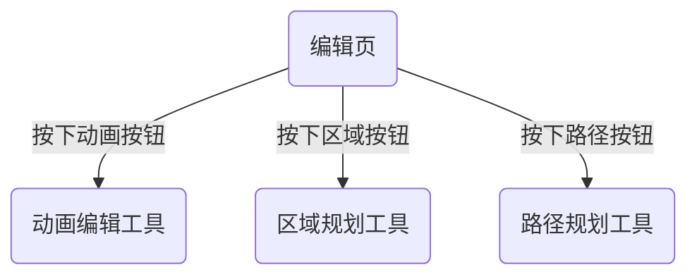
```mermaid
graph TD; 
EditPage(编辑页)-->|按下动画按钮|AnimPage(动画编辑工具); 
EditPage-->|按下区域按钮|AreaPage(区域规划工具); 
EditPage-->|按下路径按钮|PathPage(路径规划工具); 
```

#### 动画编辑

一个方案中可以添加若干条动画，动画按开始时间顺序列表显示。


**添加动画**

按下添加按钮，显示添加动画对话框，默认时间为按下前选中项的时间（如无选中项，默认为最末项时间）。

对话框包含**文字**、**相机**、**图片**、**模型**等标签。

**施工进度模拟**文件导入

原型图


实图


#### 区域规划

对话框打开时，可以切换查看、编辑状态。以镇区现状图为例：

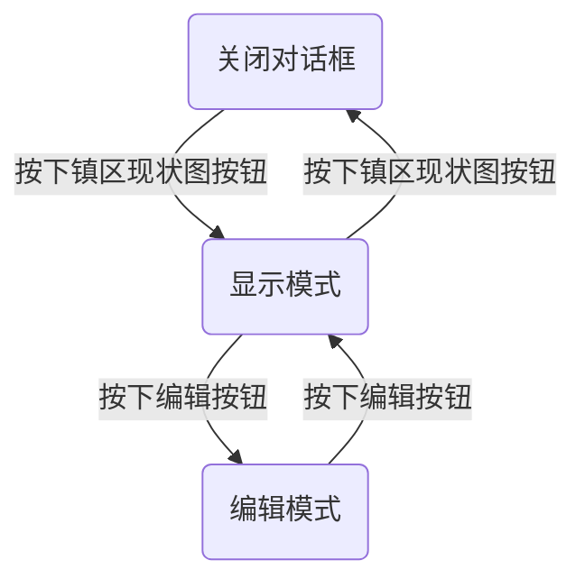
```mermaid
graph TD; 
AreaPlanEditDlgHide(关闭对话框)-->|按下镇区现状图按钮|AreaPlanEditDlgShow(打开对话框); 
AreaPlanEditDlgShow(打开对话框)-->|按下镇区现状图按钮|AreaPlanEditDlgHide; 
AreaPlanEditDlgShow(显示模式)-->|按下编辑按钮|AreaPlanEditDlgEdit(编辑模式); 
AreaPlanEditDlgEdit-->|按下编辑按钮|AreaPlanEditDlgShow; 
```
**编辑**：编辑模式下，可以选中对话框上任意一个图例按钮，在地图上进行编辑。以居住用地规划为例：

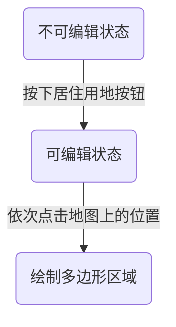
```mermaid
graph TD; 
UnMarkable(不可编辑状态)-->|按下居住用地按钮|Markable(可编辑状态); 
Markable(可编辑状态)-->|依次点击地图上的位置|DrawPolygon(绘制多边形区域); 
```
**查看**：查看模式下，可以通过图例对应的复选按钮来控制规划区域的显示和隐藏。，以居住用地为例：

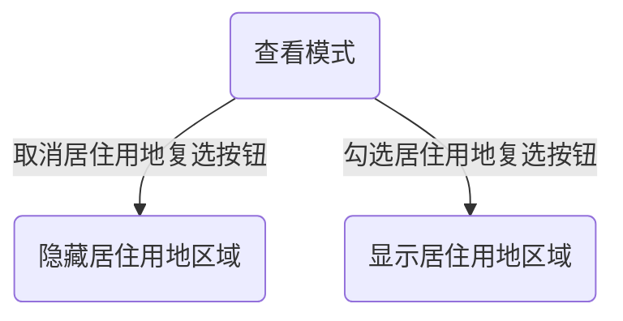
```mermaid
graph TD; 
AreaPlanDlgShow(查看模式)-->|取消居住用地复选按钮|HideArea(隐藏居住用地区域); 
AreaPlanDlgShow-->|勾选居住用地复选按钮|ShowArea(显示居住用地区域); 
```
原型图


实图


### 演示页

用户进行编辑操作后，可以点击演示按钮，使用演示工具条（开始、暂停、快进等）查看编辑效果。

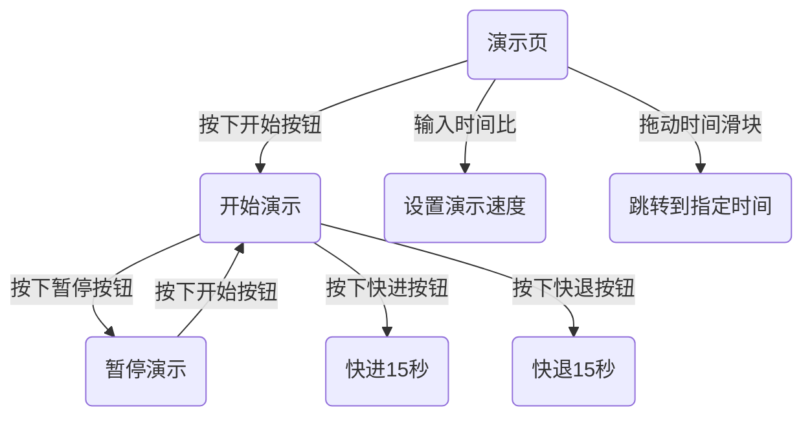
```mermaid
graph TD; 
PlayPage(演示页)-->|按下开始按钮|Play(开始演示); 
Play-->|按下暂停按钮|Pause(暂停演示); 
Pause-->|按下开始按钮|Play(开始演示); 
Play-->|按下快进按钮|Forward(快进15秒); 
Play-->|按下快退按钮|Backward(快退15秒); 
PlayPage(演示页)-->|输入时间比|SetRatio(设置演示速度); 
PlayPage(演示页)-->|拖动时间滑块|Skip(跳转到指定时间); 
```

原型图


### 信息页

用户可以查看包括规划区房屋信息在内的诸多信息统计图表（需要用户事先编辑或导入数据）。

### 设置页

用户可以切换GIS专题数据（人口分布、高程数据等等）、设置当前时间（可观察到光照效果变化）等。

## 模块

### 场景图形

几乎所有模块都需要使用场景图形。所以各模块应当实现以下接口：

```C++
	void setSceneGraph(ISceneGraph*);
```

### 方案管理

方案管理模块包含方案的新建、删除、编辑、保存、加载等。

方案管理模块统一管理文件目录，在新建方案时根据其他各模块名称统一分配，调用其他模块来完成方案的新建、编辑、删除、保存和加载。

#### 配置

方案保存在BIN/Data/Scenarios目录中，每个方案包含一个配置文件和若干子目录，子目录包括区域规划数据、路径规划数据、模型数据、场景动画等。如图是SCZ方案目录结构示例：

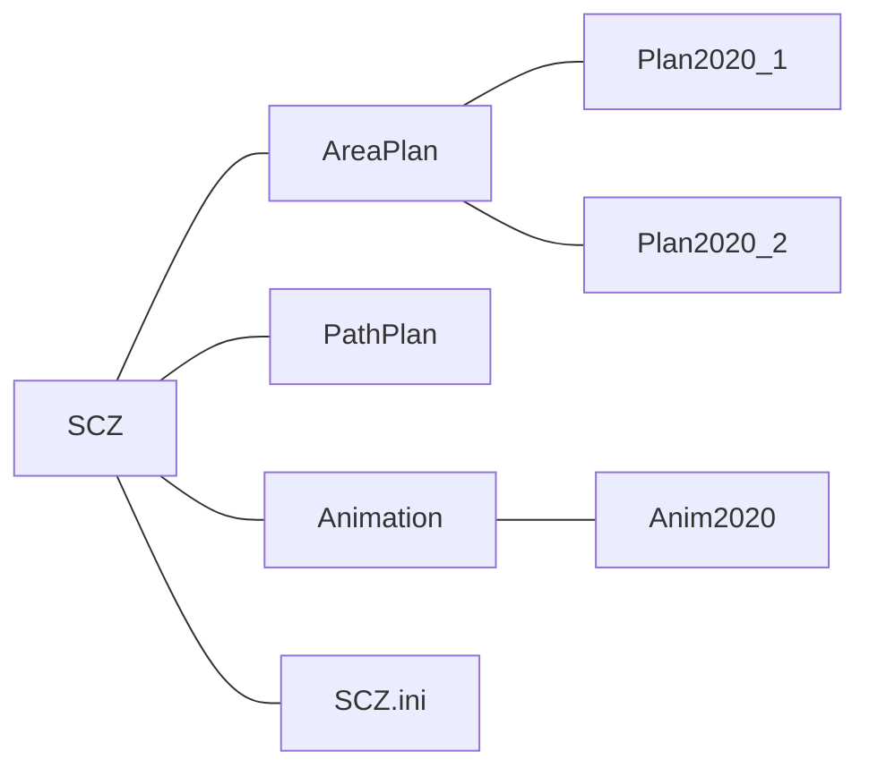
```mermaid
graph LR;  
　 SCZ---AreaPlan;
　 AreaPlan---Plan2020_1;
　 AreaPlan---Plan2020_2; 
　 SCZ---PathPlan; 
　 SCZ---Animation---Anim2020; 
　 SCZ---SCZ.ini; 
```

配置文件信息包括方案名称、方案类型、方案描述、创建人员、创建时间、修改时间、专题数据。

```ini
name="SCZ"
type="DEFAULT"
description="Something"
author="WXL"
datetime_create=""
datetime_mod=""
data_feature=""
```
#### 接口

**方案项（ScenarioItem）**定义了方案的新建、清除、保存和加载接口。当方案项被修改时，应当发出信号dataChanged()，方案管理可以执行save()保存该项。

```c++
class ScenarioItem    
{
    // create   : 新建方案时调用
    virtual void create() = 0;
    // clear    : 切换方案前清除，以便加载新方案
    virtual void clear() = 0;
    // load     : 加载方案时调用
    virtual void load() = 0;
    // load     : 保存方案时调用
    virtual void save() = 0;
signals:
    void dataChanged();
};
```
*注：清除是为了切换方案，而删除文件是由方案管理直接负责。*

**方案子模块**，通俗讲，是由方案管理模块统一管理的其他模块（如动画管理、区域规划等）；而在代码层面，**方案子模块**是指**方案项（ScenarioItem）**接口的实现（可能是模块间的适配器）。

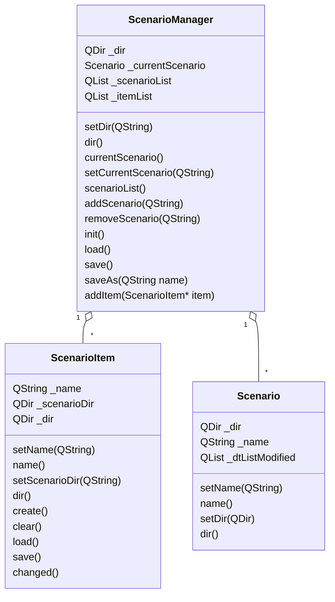
```mermaid
classDiagram
class ScenarioManager
ScenarioManager : QDir _dir
ScenarioManager : Scenario _currentScenario
ScenarioManager : QList<Scenario>  _scenarioList
ScenarioManager : QList<ScenarioItem>  _itemList
ScenarioManager : setDir(QString)
ScenarioManager : dir()
ScenarioManager : currentScenario()
ScenarioManager : setCurrentScenario(QString)
ScenarioManager : scenarioList()
ScenarioManager : addScenario(QString)
ScenarioManager : removeScenario(QString)
ScenarioManager : init()
ScenarioManager : load()
ScenarioManager : save()
ScenarioManager : saveAs(QString name)
ScenarioManager : addItem(ScenarioItem* item)
ScenarioManager  "1" o-- "*" ScenarioItem
ScenarioManager  "1" o-- "*" Scenario
class Scenario
Scenario : QDir  _dir
Scenario : QString  _name
Scenario : QList<QDateTime>  _dtListModified
Scenario : setName(QString)
Scenario : name()
Scenario : setDir(QDir)
Scenario : dir()
class ScenarioItem
ScenarioItem : QString  _name
ScenarioItem : QDir _scenarioDir
ScenarioItem : QDir _dir
ScenarioItem : setName(QString)
ScenarioItem : name()
ScenarioItem : setScenarioDir(QString)
ScenarioItem : dir()
ScenarioItem : create()
ScenarioItem : clear()
ScenarioItem : load()
ScenarioItem : save()
ScenarioItem : changed()
```

#### 功能

**加载/删除**

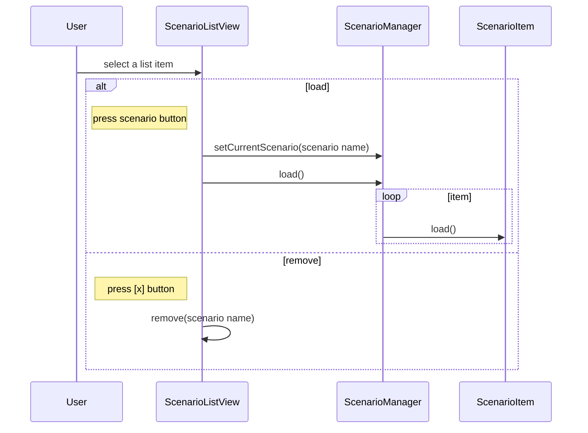
```mermaid
sequenceDiagram
    User->>ScenarioListView: select a list item
    alt load     
    	Note left of ScenarioListView: press scenario button
    	ScenarioListView->>ScenarioManager: setCurrentScenario(scenario name)   
    	ScenarioListView->>ScenarioManager: load() 	
    	loop item
    		ScenarioManager->>ScenarioItem: load()
    	end
    else remove  
    	Note left of ScenarioListView: press [x] button    
    	ScenarioListView->>ScenarioListView: remove(scenario name)  	
    end
```
**保存**

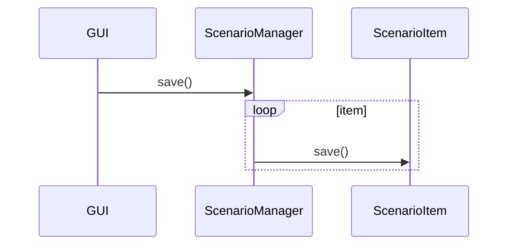
```mermaid
sequenceDiagram
    GUI->>ScenarioManager: save()
    loop item
    	ScenarioManager->>ScenarioItem: save()
    end
```

**编辑**

编辑由实现了ScenarioItem接口的模块负责，编辑后，模块会发送信号通知ScenarioManager和MainWindow。

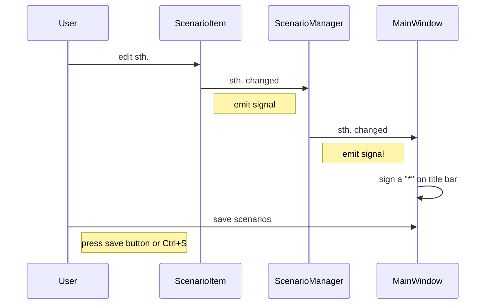
```mermaid
sequenceDiagram
    User->>ScenarioItem: edit sth.
    ScenarioItem->>ScenarioManager: sth. changed
    Note left of ScenarioManager: emit signal
    ScenarioManager->>MainWindow: sth. changed
    Note right of ScenarioManager: emit signal
    MainWindow->>MainWindow: sign a "*" on title bar
    User->>MainWindow: save scenarios
    Note right of User: press save button or Ctrl+S
```
**新建**

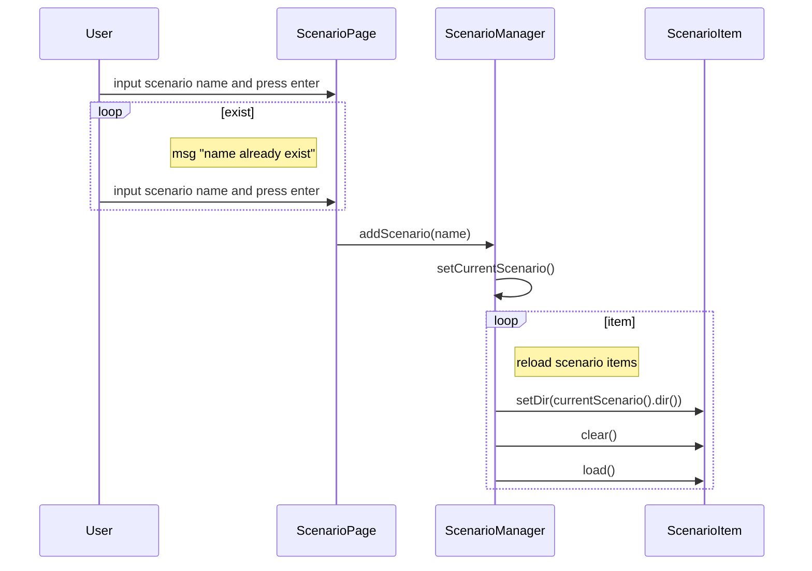
```mermaid
sequenceDiagram
    User->>ScenarioPage: input scenario name and press enter    
    loop exist    
    	Note left of ScenarioPage: msg "name already exist"
    	User->>ScenarioPage: input scenario name and press enter   
    end    	 
	ScenarioPage->>ScenarioManager: addScenario(name)   
	ScenarioManager->>ScenarioManager: setCurrentScenario() 
    loop item    
    	Note right of ScenarioManager: reload scenario items
		ScenarioManager->>ScenarioItem: setDir(currentScenario().dir()) 
		ScenarioManager->>ScenarioItem: clear() 
		ScenarioManager->>ScenarioItem: load() 
    end    	 
```
### 模型管理

模型管理模块负责模型的添加、编辑（移动、旋转、放缩）、删除、保存和加载。

*此模块可以固化，部分函数过长，需要整理代码*

#### 属性元数据
模型Model利用Qt元数据机制，使用Q_PROPERTY宏声明需要保存和加载的属性，使用元对象系统，可以方便、批量的进行属性读写操作。
```c++
	Q_PROPERTY(QString _strName READ name WRITE setName)
	Q_PROPERTY(QString _strFilePath READ filePath WRITE setFilePath)
	Q_PROPERTY(double _lon READ lon WRITE setLon)
	Q_PROPERTY(double _lat READ lat WRITE setLat)
	Q_PROPERTY(double _alt READ alt WRITE setAlt)
	Q_PROPERTY(double _rotX READ rotX WRITE setRotX)
	Q_PROPERTY(double _rotY READ rotY WRITE setRotY)
	Q_PROPERTY(double _rotZ READ rotZ WRITE setRotZ)
	Q_PROPERTY(double _scaleX READ scaleX WRITE setScaleX)
	Q_PROPERTY(double _scaleY READ scaleY WRITE setScaleY)
	Q_PROPERTY(double _scaleZ READ scaleZ WRITE setScaleZ)
```
#### 位置和姿态

在场景内使用模型操作器编辑模型的位置和姿态，也可以使用模型属性对话框来编辑。

模型保存时会调用Update先更新场景内的模型位置和姿态，再写入到文件。

#### 保存和加载

### 动画管理

动画包括**文字显示**、**图片显示**、**镜头移动**、**模型动画**、**施工模拟**。

*提问：施工进度模拟是否需要整合到动画模块？*

动画管理模块辅助动画的添加、编辑、删除、保存和加载。

文字显示、图片显示、镜头移动、模型动画这4种类型的动画都包含开始时间、持续时间、内容三个要素。

**内容**在图片动画中体现为图片文件地址；在文本动画中体现为文字内容；镜头动画内容是三维坐标（经度纬度高度），模型动画的内容包括模型名、是否显示等信息（字符串列表形式存储）。此外图片动画中图片还需要提供尺寸数据（左、上、宽、高）。

#### 接口

**施工进度模拟**由一系列时间点及相对应的BIM信息描述。**施工数据**采用数据库形式存储，支持EXCEL和JSON格式导入，示例如下：

| DT         | Content     | Expense(Unit-10000￥) | Headcount |
| ---------- | ----------- | --------------------- | --------- |
| 2018/01/01 | -1F\|基本墙 | 45.4                  | 10        |
| 2018/01/02 | -1F         | 69.1                  | 15        |
| 2018/01/03 | 1F\|基本墙  | 92.8                  | 10        |
| 2018/01/04 | 1F\|上悬窗  | 116.5                 | 15        |

**建筑构件**是指构成建筑物各个要素。如果把建筑物看成是一个产品，那建筑构件就是指这个产品当中的零件。建筑物当中的构件主要有：楼（屋）面、墙体、柱子、基础等。

在本系统中，**构件（Component)**指的是三维建筑模型的**子节点（child）**。模拟时，表现为到达指定时间点时，对应的模型构件才会显示。施工数据被封装到**建造构件命令（CommandBuildComponent）**，它实现了命令接口execute和undo，表示构件的建造和拆除。

```C++
	void execute();     // 建造，调用模型接口显示构件
	void undo();        // 拆除，调用模型接口隐藏构件
```
**模拟（Simulation）**接口定义了模拟和现实间的时间比率以及类似播放器的开始、暂停、恢复、停止、跳转功能，如下

```C++
	void setTimeRatio(float ratio);						// sim : real
	void setStartDateTime(const QDateTime & dt);	
	void setEndDateTime(const QDateTime & dt);			// optional
	void start();
	void pause();
	void resume();
	void stop();
	void pauseOrResume();
	void goTo(QDateTime& dt);
```

**过程（Process）**定义了到达某时间就会被模拟器调用的接口，如下

```C++
	virtual void goTo(QDateTime dt) = 0;
```

**施工过程（ProcessBuild）**实现了**过程（Process）**接口。要点如下：

1. 模拟前从数据库读取过程数据，并支持从文件导入数据。

2. 按时间序列准备施工数据，以备goTo调用。

3. 记录当前模拟时间进度，以便下次调用goTo时根据时间调整前进或后退。

   
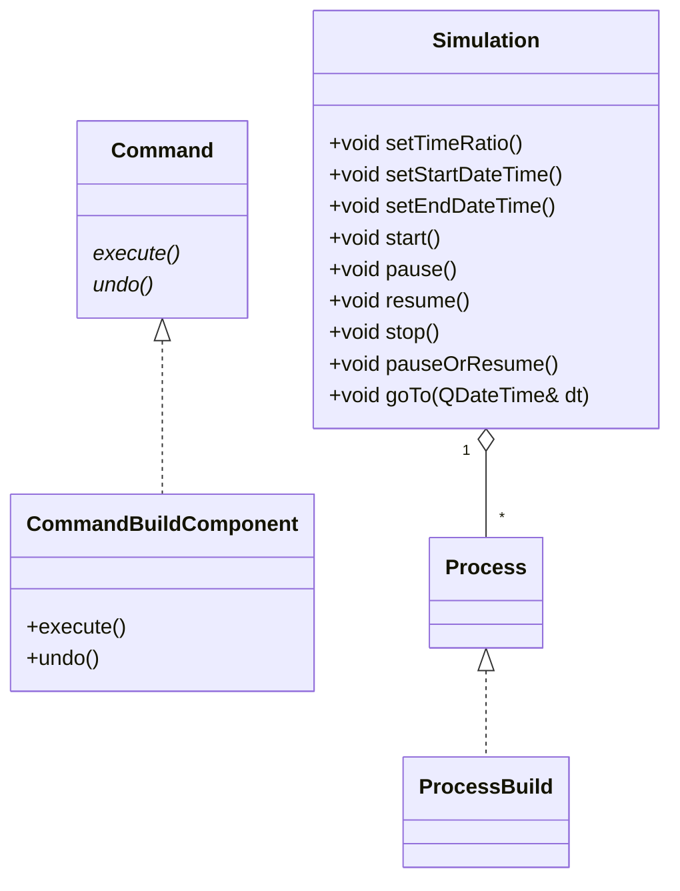
```mermaid
classDiagram
class Command
Command : execute()*
Command : undo()*
class CommandBuildComponent
CommandBuildComponent : +execute()
CommandBuildComponent : +undo()
Command <|.. CommandBuildComponent
class Process
class ProcessBuild
Process <|.. ProcessBuild
class Simulation
Simulation : +void setTimeRatio()
Simulation : +void setStartDateTime()
Simulation : +void setEndDateTime()
Simulation : +void start()
Simulation : +void pause()
Simulation : +void resume()
Simulation : +void stop()
Simulation : +void pauseOrResume()
Simulation : +void goTo(QDateTime& dt)
Simulation "1" o-- "*" Process
```
### 区域规划


#### 接口

**区域规划管理（AreaPlanManager）**：管理所有区域规划方案的新建、编辑、保存、加载等功能。

通过以下方法为区域规划模块设置三维场景图形接口，以编辑区域（绘制点、线、多边形）。

```C++
void AreaPlanManager::setSceneGraph(ISceneGraph*);
```
通过以下方法为区域规划管理实现了**方案项（ScenarioItem）**接口，由方案管理模块统一负责根目录、加载、保存等。

```C++
    // create   : 新建方案时调用
    virtual void create(){}
    // clear    : 切换方案前清除，以便加载新方案
    virtual void clear();
    // load     : 加载方案时调用
    virtual void load();
    // save     : 保存方案时调用
    virtual void save();
```
**区域规划（AreaPlan）**：或称区域规划方案，包含若干区域规划图层，负责所有区域整体的显示和隐藏，还允许用户选择某一特定图层进行显示或编辑。

**区域规划图层（AreaPlanLayer)**：每个图层对应业务上的一种**区域（AreaPolygon）**类型（如农业用地）。具有名称、图例、颜色等属性，可以控制地图上该类区域显示和隐藏，通过调用**区域编辑器**和**区域加载器**进行区域的创建和删除。

**区域(AreaPolygon)**：即多边形区域，可以通过**区域编辑器**或**区域加载器**添加区域。

**区域编辑器(AreaPolygonEditor)**：调用三维接口进行多边形的创建和编辑。

**区域加载器(AreaPolygonLoader)**：从Json读取多边形数据和将数据保存到Json。

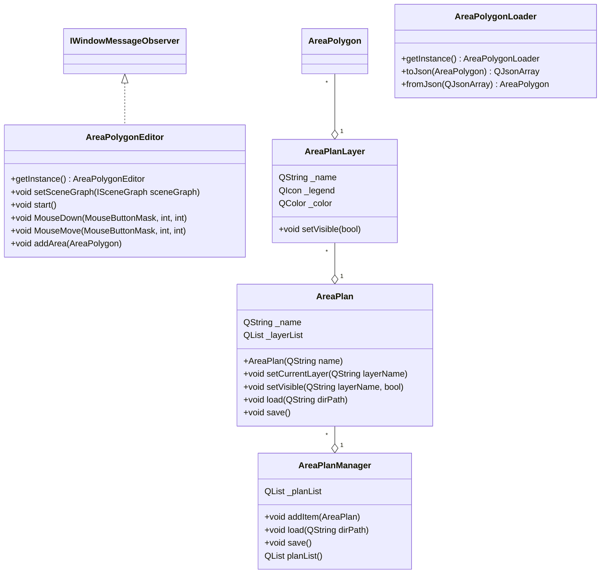
```mermaid
classDiagram
class IWindowMessageObserver
class AreaPolygonEditor
AreaPolygonEditor : +getInstance() AreaPolygonEditor
AreaPolygonEditor : +void setSceneGraph(ISceneGraph sceneGraph)
AreaPolygonEditor : +void start()
AreaPolygonEditor : +void MouseDown(MouseButtonMask, int, int)
AreaPolygonEditor : +void MouseMove(MouseButtonMask, int, int)
AreaPolygonEditor : +void addArea(AreaPolygon)
IWindowMessageObserver <|.. AreaPolygonEditor
class AreaPolygon
class AreaPlanLayer
AreaPlanLayer : +void setVisible(bool)
AreaPlanLayer : QString			_name
AreaPlanLayer : QIcon			_legend			
AreaPlanLayer : QColor			_color
AreaPolygon "*" --o "1" AreaPlanLayer
class AreaPlan
AreaPlan : QString               _name
AreaPlan : QList<AreaPlanLayer> _layerList
AreaPlan : +AreaPlan(QString name)
AreaPlan : +void setCurrentLayer(QString layerName)
AreaPlan : +void setVisible(QString layerName, bool)
AreaPlan : +void load(QString dirPath)
AreaPlan : +void save()
AreaPlanLayer "*" --o "1" AreaPlan
class AreaPlanManager
AreaPlanManager : +void addItem(AreaPlan)
AreaPlanManager : +void load(QString dirPath)
AreaPlanManager : +void save()
AreaPlanManager : QList<AreaPlan> planList()
AreaPlanManager : QList<AreaPlan> _planList
AreaPlan "*" --o "1" AreaPlanManager
class AreaPolygonLoader
AreaPolygonLoader : +getInstance() AreaPolygonLoader
AreaPolygonLoader : +toJson(AreaPolygon) QJsonArray
AreaPolygonLoader : +fromJson(QJsonArray) AreaPolygon
```
#### 功能

区域规划模块包含（多边形）区域的**加载**、**查看**、**编辑**、**保存**等功能。

**编辑**

*这是旧版本的编辑时序图*

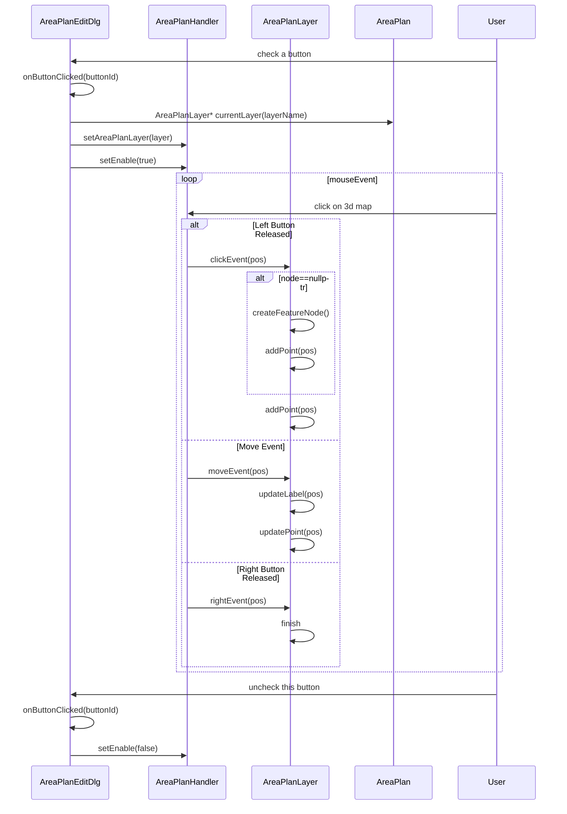
```mermaid
sequenceDiagram
	participant AreaPlanEditDlg
	participant AreaPlanHandler
	participant AreaPlanLayer
	participant AreaPlan
    User->>AreaPlanEditDlg: check a button
    AreaPlanEditDlg->>AreaPlanEditDlg: onButtonClicked(buttonId)  
    AreaPlanEditDlg->>AreaPlan: AreaPlanLayer* currentLayer(layerName)  
    AreaPlanEditDlg->>AreaPlanHandler: setAreaPlanLayer(layer)
    AreaPlanEditDlg->>AreaPlanHandler: setEnable(true)
    loop mouseEvent
        User->>AreaPlanHandler: click on 3d map
        alt Left Button Released      
    			AreaPlanHandler->>AreaPlanLayer: clickEvent(pos)      
        	alt node==nullptr
    			AreaPlanLayer->>AreaPlanLayer: createFeatureNode()
        		AreaPlanLayer->>AreaPlanLayer: addPoint(pos)
			end
        	AreaPlanLayer->>AreaPlanLayer: addPoint(pos)
		else Move Event
    		AreaPlanHandler->>AreaPlanLayer: moveEvent(pos)    
        	AreaPlanLayer->>AreaPlanLayer: updateLabel(pos)
        	AreaPlanLayer->>AreaPlanLayer: updatePoint(pos)
		else Right Button Released
    		AreaPlanHandler->>AreaPlanLayer: rightEvent(pos)   
			AreaPlanLayer->>AreaPlanLayer: finish
		end
    end
    User->>AreaPlanEditDlg: uncheck this button
    AreaPlanEditDlg->>AreaPlanEditDlg: onButtonClicked(buttonId)    
    AreaPlanEditDlg->>AreaPlanHandler: setEnable(false)
```

**保存**：编辑后需要按**保存**按钮或快捷键Ctrl+S写入到文件。

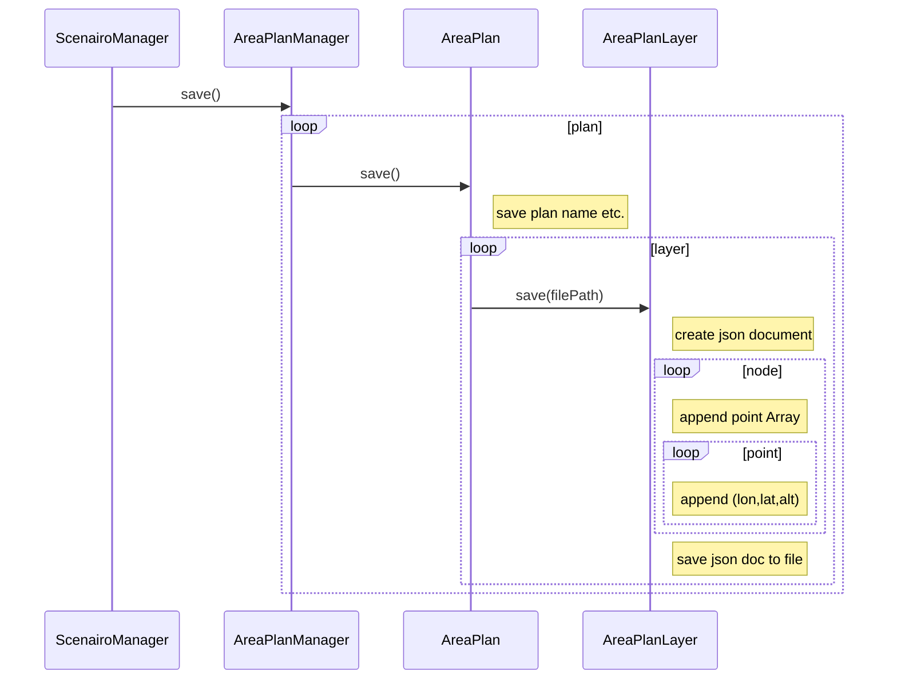
```mermaid
sequenceDiagram
    ScenairoManager->>AreaPlanManager: save()
    loop plan
    	AreaPlanManager->>AreaPlan: save()
        Note right of AreaPlan: save plan name etc.
    	loop layer
        	AreaPlan->>AreaPlanLayer: save(filePath)        	
        	Note right of AreaPlanLayer: create json document
    		loop node
        		Note right of AreaPlanLayer: append point Array
    			loop point
        		Note right of AreaPlanLayer: append (lon,lat,alt)
        		end
        	end	
        	Note right of AreaPlanLayer: save json doc to file
    	end
    end
```

**加载**：加载方案（Scenario）时，加载区域规划文件。

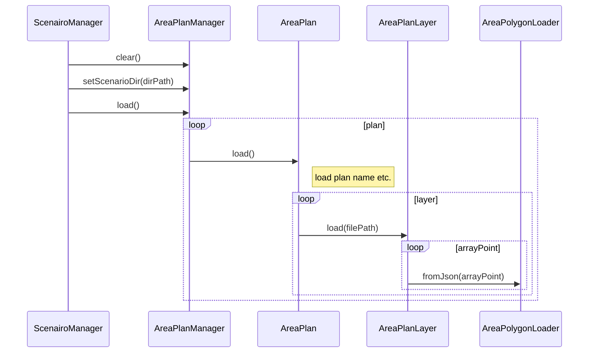
```mermaid
sequenceDiagram
    ScenairoManager->>AreaPlanManager: clear()
    ScenairoManager->>AreaPlanManager: setScenarioDir(dirPath)
    ScenairoManager->>AreaPlanManager: load()
    loop plan
    	AreaPlanManager->>AreaPlan: load()
        Note right of AreaPlan: load plan name etc.
    	loop layer
        	AreaPlan->>AreaPlanLayer: load(filePath)
    		loop arrayPoint
        		AreaPlanLayer->>AreaPolygonLoader: fromJson(arrayPoint)
        	end
    	end
    end
```

**查看**

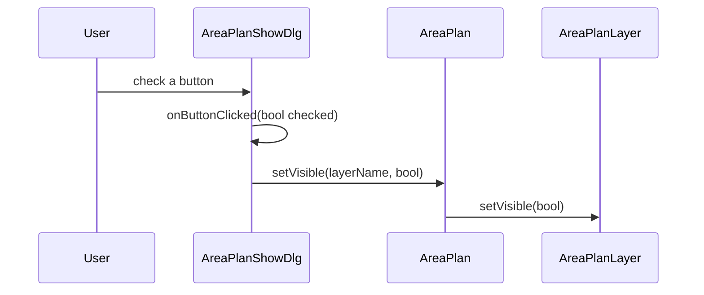
```mermaid
sequenceDiagram
    User->>AreaPlanShowDlg: check a button
    AreaPlanShowDlg->>AreaPlanShowDlg: onButtonClicked(bool checked)
    AreaPlanShowDlg->>AreaPlan: setVisible(layerName, bool)
    AreaPlan->>AreaPlanLayer: setVisible(bool)
```

*扩展：为高级用户提供**图例编辑**功能。*


### 路径规划

除界面外代码由zhanggz编写（z待补充）。

（讨论：如需此模块，可能要整理代码）

### 专题数据

专题数据模块负责高程、地质分析、地表覆盖、全球水系、全球景观、全球人口、全球温度等各类数据的显示切换。

（讨论：此模块可以固化，无需大量改动）

### 信息统计

信息统计模块包含显示、编辑、保存、加载、定位、统计等功能。

**显示**：信息以**文字注记**形式显示在三维地图上。

**保存**：信息编辑后点击确定按钮将信息**保存**到数据库文件。

**加载**：启动时系统从数据库**加载**并显示，无需操作。

**编辑**：

```mermaid
graph TD; 
Markable(可编辑状态)-->|按下信息按钮|UnMarkable(不可编辑状态); 
UnMarkable-->|按下信息按钮|Markable; 
Markable-->|点击模型|EditDialog(显示编辑对话框); 
EditDialog(显示编辑对话框)-->|点击确定按钮|Confirm(显示注记并关闭对话框); 
EditDialog-->|点击取消按钮|Cancel(取消注记并关闭对话框); 
```

**定位**：

```mermaid
graph TD; 
HouseInfoQueryDlgHide(信息查询对话框隐藏)-->|按下定位按钮|HouseInfoQueryDlgShow(信息查询对话框显示); 
HouseInfoQueryDlgShow-->|按下定位按钮|HouseInfoQueryDlgHide; 
HouseInfoQueryDlgShow-->|输出名称并点击搜索|Location(切换镜头对应坐标位置); 
```
**统计**：

对常用的信息如日期、面积等进行统计，以**文字**、**图表**形式展示。

（讨论：最近项目的试验功能，尚不成熟，是否强烈需求此模块功能）

### 量算分析

量算分析模块包含长度测量、高度测量、面积测量、视域分析等功能。

（讨论：此模块可以固化，无需大量改动）