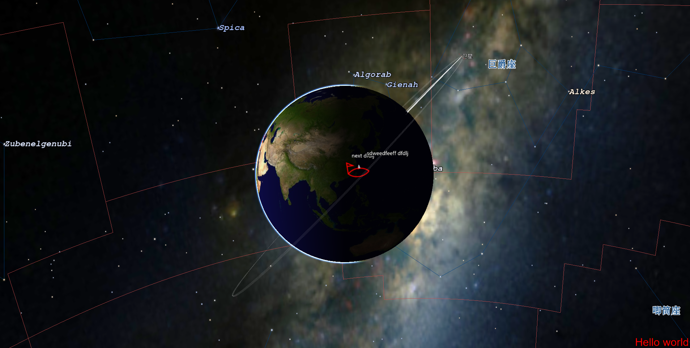

# Map

本项目使用QT5+基于osg和osgearth封装的渲染平台

主要工作：

* 对Qt和OSG的OpenGL状态进行了分离
* 分离渲染线程和Qt的界面主线程，使得渲染不影响主界面的流畅性
* 真实的恒星位置、星座、星区，显示
* 屏幕显示
* 点、线、面、体的绘制
* 灵活视点控制
* 一键二、三维切换
* 模型点选的统一控制
* 统一状态，减少渲染时的状态切换

依赖库:

* [window依赖的第三方库下载地址](https://github.com/MJYCo-Ltd/VersionMath_Map_Depend "依赖库和数据")
* 本工程的矩阵运算、空间目标运算算法依赖于[VersionMath](https://github.com/MJYCo-Ltd/VersionMath "算法")

不足:

* 没有对OSG的状态进行彻底的合并
* 代码封装不彻底，暴露过多的OSG的机制
